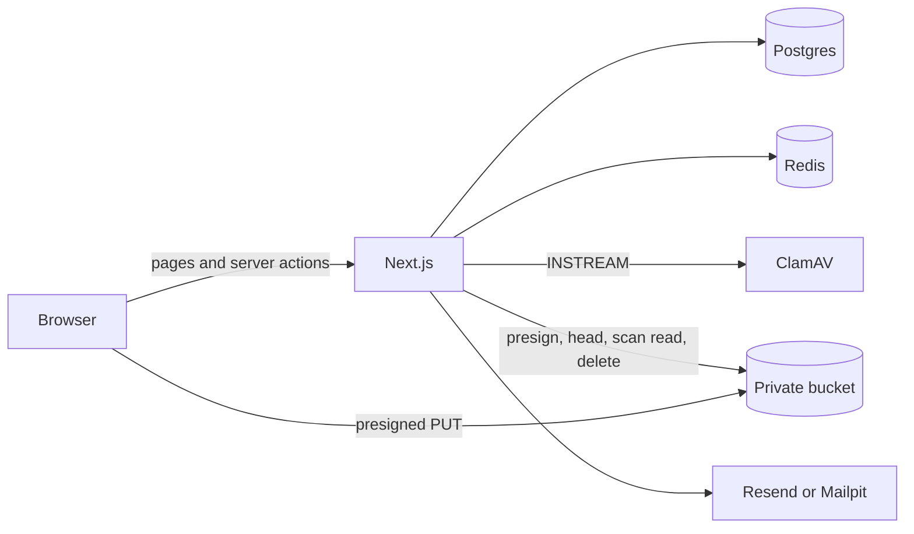

<div align="center">
  
  <div>
    
    
    
    
  </div>

  <h3 align="center">Store and share files</h3>
</div>

StoreIt is a file storage app. People sign in with an email code, upload files straight to object storage, and share them with other accounts. The app server never holds the file bytes during upload. Postgres remembers who owns each file. A private bucket holds the bytes.

This document is the map of the system: what each piece is for, and which file to open when you want to explain the design.

## Stack

- Next.js 15 App Router and React 19. UI in `app/` and `components/`. Mutations are server actions in `lib/actions/`.
- PostgreSQL 16 for users, sessions, files, and upload bookkeeping.
- Redis for sign-in challenges and the limit on how often a code can be emailed.
- S3-compatible object storage. Locally that is MinIO. The same code path talks to Cloudflare R2.
- ClamAV scans a file after it lands in the bucket and before a row is saved.
- Mailpit catches sign-in email in development. Resend sends it in production, after a domain is verified.

## How the pieces fit



The bucket is private. Nothing is served from a public object URL. Opening or downloading a file uses a signed URL that lasts one hour.

## Sign-in

1. The person enters an email. `beginLogin` in `lib/actions/user.actions.ts` stores a short-lived challenge in Redis and returns its id to the browser. That id is not the user id.
2. If the email has no account, sign-in opens the sign-up form with that address filled in and a note that they need to create an account. If the account exists, a 6-digit code is emailed. Resending replaces that code and tells them the previous one no longer works. A Redis limit allows 5 sends per email per 15 minutes.
3. An existing email on the sign-up form is treated as a sign-in. The person gets a code. They are not told that the account already exists.
4. `verifySecret` reads the challenge. A wrong code is counted. Five wrong codes delete the challenge. A correct code creates a row in `sessions` and sets the `storeit-session` cookie. The cookie is httpOnly. The database stores only a hash of the token.
5. Signing out deletes the current session. Signing out everywhere deletes every session for that user, including other browsers. Sessions live in Postgres so a Redis restart does not sign people out.

OTP hashes and session token hashes are SHA-256, keyed with `AUTH_SECRET` for the code. Codes expire after 10 minutes. Sessions last 30 days.

## Upload

1. `createUpload` locks the user row, adds the size of existing files and other in-flight uploads, and refuses the upload if it would pass the quota (`STORAGE_QUOTA_BYTES`, 2 GB by default). It inserts a `pending_uploads` row that expires in one hour and returns a presigned PUT.
2. The browser uploads the bytes to the bucket with that URL. The app server is not in that path.
3. `completeUpload` checks the stored size, streams the object to ClamAV, and only then inserts the `files` row and deletes the pending row. An infected object is deleted and never listed. If the scanner cannot be reached, the file is not saved.

Object keys look like `owners/{ownerId}/{fileId}`. Renames change the database name only. Sharing stores each address in `file_access` with a set of privileges. View is always on. Rename and delete are separate switches the owner can turn on before sharing or change later. Only the owner can share. Recipients are matched by email.

## Opening a file

`getFiles` loads rows from Postgres, then `fileAccessUrls` signs a view URL and a download URL. SVG and HTML are signed as downloads so the browser does not render them from the bucket origin. Search uses `ILIKE` with a trigram index (`pg_trgm`) on the file name.

## Where to read the code

| Concern | File |
| --- | --- |
| Sign-in, sessions, OTP | `lib/auth.ts`, `lib/actions/user.actions.ts` |
| Challenges and rate limits | `lib/challenges.ts`, `lib/rate-limit.ts`, `lib/redis.ts` |
| Sign-in email | `lib/mail.ts` |
| Upload, list, rename, share, delete | `lib/actions/file.actions.ts` |
| Bucket client and signed URLs | `lib/storage.ts` |
| Malware scan | `lib/scanner.ts` |
| Quota | `lib/quota.ts` |
| Failed deletes and expired uploads | `lib/object-retention.ts`, `scripts/sweep.ts`, `app/api/cron/sweep/route.ts` |
| Schema | `docker/postgres/init.sql` |
| Local services | `docker-compose.yml` |
| Pages | `app/(root)/page.tsx` and `app/(root)/[type]/page.tsx` |

`FileDocument` in `types/index.d.ts` is the shape the UI already expects (`$id`, `$createdAt`, `owner`, `users`, `url`, `downloadUrl`). The actions map database rows into that shape.

## Local setup

You need Git, Node.js, [bun](https://bun.sh), and Docker.

```bash
git clone https://github.com/d-code-h/storeit.git
cd storeit
bun install
cp .env.example .env.local
openssl rand -hex 32
```

Put the generated value in `AUTH_SECRET` and another in `CRON_SECRET`. Then:

```bash
docker compose up -d
bun dev
```

Open [http://localhost:3000](http://localhost:3000).

The compose file publishes these ports because the conventional ones are often already taken on a shared machine:

| Service | Address |
| --- | --- |
| Postgres | `localhost:5436` |
| Redis | `localhost:6380` |
| MinIO API | `http://127.0.0.1:9010` |
| MinIO console | [http://localhost:9011](http://localhost:9011) |
| ClamAV | `localhost:3310` |
| Mailpit inbox | [http://localhost:8026](http://localhost:8026) |

ClamAV downloads virus definitions on first start. Wait until the container is healthy before expecting scans to succeed. The bucket `storeit` is created by the app the first time it talks to MinIO.

Copy names from `.env.example`. Do not commit `.env.local`.

## Email

`lib/mail.ts` sends a short HTML message and a plain-text alternative. The code is the only thing the person needs to read.

Development (`bun dev`) always delivers to Mailpit at [http://localhost:8026](http://localhost:8026), and prints the code in the server log. A `RESEND_API_KEY` in `.env.local` is ignored until the app runs with `NODE_ENV=production`. That key's default restriction only allows mail to the Resend account address, which is the wrong path for local sign-in.

Production uses Resend when `RESEND_API_KEY` is set. Verify a domain at Resend first, then set `MAIL_FROM` to an address on that domain. `noreply@storeit.local` is the Mailpit placeholder. If it is still set in production, the app sends as `onboarding@resend.dev`, which only reaches the address on the Resend account.

## When you deploy

Do these once the app is on a real host. Nothing in the process runs them on a timer.

1. Verify a domain in Resend and set `RESEND_API_KEY` and `MAIL_FROM` in the production environment.
2. Point `S3_*` at the R2 bucket and allow the app origin on `PUT`, `GET`, and `HEAD`.
3. Schedule object cleanup about once an hour. Call `POST /api/cron/sweep` with header `Authorization: Bearer <CRON_SECRET>`. That moves expired unfinished uploads into the deletion queue and retries object deletes, up to 10 attempts each. `bun run maintenance:sweep` is the same job from a shell on a machine that can reach Postgres and the bucket. Redis is not involved.
4. Schedule `bun run db:backup` on a machine that can run `docker exec` against Postgres, or run `pg_dump -Fc` another way. Keep the dumps somewhere the app disk is not the only copy. `backups/` is gitignored. The dump is the catalog. Object bytes stay in the bucket.

## Object storage in production

Create a Cloudflare R2 bucket and an API token, then replace the `S3_*` values. `.env.example` has the shape. Keep `S3_FORCE_PATH_STYLE=true` so the signed URL host matches the endpoint. The AWS SDK checksum mode is `WHEN_REQUIRED` because R2 rejects the SDK's default CRC32 headers.

Browser uploads are cross-origin: the page is on the app, the PUT goes to the bucket. Community MinIO does not implement per-bucket CORS (that API returns `NotImplemented`, and the app ignores it). Locally, `MINIO_API_CORS_ALLOW_ORIGIN` allows `http://localhost:3000` and `http://127.0.0.1:3000`. On R2, allow the app origin for `PUT`, `GET`, and `HEAD` in the bucket CORS rules.

## Transactions and leftover objects

Postgres transactions cover rows that change together. They do not cover the browser or the bucket.

- Starting an upload locks the user row, checks the quota, and inserts `pending_uploads` in one transaction. The presigned URL is created after that commit. If signing fails, the pending row is deleted. Nothing has been stored yet.
- Finishing an upload inserts the `files` row and deletes the pending row in one transaction, under an advisory lock on the object key. If that transaction rolls back, the file is not listed.
- Deleting a file removes the `files` row and inserts an `object_deletions` row in one transaction. The bucket delete runs after the commit. Replacing the code and storing a new email code is the same shape: one transaction for the rows, then the mail provider.
- A wrong, infected, or over-quota object is discarded by the same pair of steps: commit the catalog change and the deletion intent, then delete the bytes. A scanner outage does not discard the object, so the same upload can be finished again.

A single transaction cannot undo a PUT the browser already made, and it cannot make MinIO or R2 roll back with Postgres. There is no two-phase commit between them. The practical order is: commit the source of truth, then do the external call, and keep a row that says the external call still needs to happen. `object_deletions` is that row. An advisory lock on the object key stops a delete and a finishing upload from passing each other.

The sweep still exists for the case no request can roll back: the browser stored the object and never called `completeUpload` (the tab closed, the network dropped). That pending row expires after one hour. How to schedule the sweep and the database dump is under [When you deploy](#when-you-deploy).

## What is cheap, and what is not

Listing a page signs two URLs per file. Signing is local HMAC work, not a round trip to the bucket. Usage on the dashboard is one grouped SQL query, not a load of every file into Node. Session lookup is deduplicated for the request.

The expensive step is finishing an upload. The server streams the object from the bucket into ClamAV. A multi-megabyte file takes as long as the scan takes. That wait is the point of the scan: the file is not listed until the verdict is in. The upload itself does not pass through the Next.js server, which is why the server action body limit is not the upload limit. The upload limit is 50 MB per file.

## Security choices worth naming

- Sign-in with an unknown email opens sign-up for that address. A wrong code still says the code is invalid.
- Five OTP attempts burn the challenge.
- The bucket is private. View and download URLs expire.
- Infected files are deleted. A scanner outage refuses the upload instead of saving it.
- The sweep route compares the authorization header in constant time and does not accept a missing secret.
- Sharing, renaming, and deleting check that the session user owns the file.
